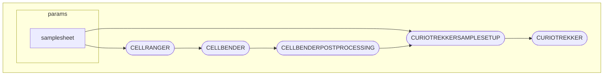

## Setup
________________________________________________________________________
### 1. Folder Creation
Make a folder you want the pipeline to occur in, typically in scratch folder.

```bash
mkdir SlideTagNextflow
```
### 2. Automated Setup
1. Make sure nextflow is installed
```bash
module load nextflow
```

1. Download the pipeline nextflow (nf) files & add them to your new folder

2. Call the setup process. (Note: Should take approximately 17 minutes.)
```bash
nextflow run setup.nf -profile singularity
```

4. Now comparing your observed file structure to the expected:

```
PipelineFolder
└── CellBender
|	├── CellBender
|	└── cellbender_latest.sif
└── CurioTrekker
|	└── curiotrekker-v1.0.0
└── References
	├── Rat
	└── Mouse
```
### 3. CellRanger Installation
CellRanger requires consenting to the 10x genomics terms & conditions: 

1. Visit this link to download the pipeline: 
		https://www.10xgenomics.com/support/software/cell-ranger/downloads

2. Download the reference data for the species into the pipeline folder

3. Add the CellRanger folder to `/SlideTagNextflow/PipelineFolder/CellRanger/`

```
PipelineFolder
└── CellRanger
|	├── cellranger-9.0.1
|	└── cellranger-9.0.1.tar.gz
└── CellBender
|	├── CellBender
|	└── cellbender_latest.sif
└── CurioTrekker
|	└── curiotrekker-v1.0.0
└── References
	├── Rat
	└── Mouse
```

### 4. Preparing Inputs

1. Download the example sample sheet & change the paths to your corresponding sample

2. If running additional samples provide the same information but in a subsequent row.
	Note: No limits on number of samples, keep adding a new row for each sample run.

### 5. Running Pipeline
Make sure you are in the directory containing the `.nf` files
```bash
nextflow run run.nf --samplesheet="/path/to/samplesheet" -profile singularity
```
Note: Change `nextflow.config` file if running larger files to fine-tune slurm request requirements.

### 6. Output Files
These files can be found at the lowest-level of your current directory (path). Intermediate files related to each process in the workflow can be found in work & outputs from each of CellRanger, CellBender & CurioTrekker can be seen.

```
results
├── CellRanger
├── CellBender
├── CurioTrekker
├── filtered_feature_bc_matrix.h5
├── metrics_summary.csv
```


# Edits to make
Add --outdir as a flag then get that to connect to CURIOTREKKERMODIFY