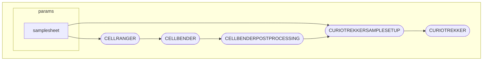

# Introduction

This nextflow pipeline is designed for processing Slide-Tag data, originating from the sequenced cDNA and surface protein files to ultimately a spatial map of cell types and gene expression. It does so by using the software packages CellRanger, CellBender & CurioTrekker in this order. 

## Overview of Workflow

```mermaid
flowchart TB
    subgraph " "
    subgraph params
    v0["samplesheet"]
    end
    v3([CELLRANGER])
    v5([CELLBENDER])
    v7([CELLBENDERPOSTPROCESSING])
    v10([CURIOTREKKERSAMPLESETUP])
    v12([CURIOTREKKER])
    v0 --> v3
    v3 --> v5
    v5 --> v7
    v0 --> v10
    v7 --> v10
    v10 --> v12
    end
```
## Setup
________________________________________________________________________
### 1. Folder Creation
Make a folder you want the pipeline to occur in, typically in scratch folder.

```bash
mkdir SlideTagNextflow
```
### 2. Automated Setup
1. Make sure nextflow is installed
```bash
module load nextflow
```

2. Download the pipeline nextflow (nf) files & add them to your new folder or clone the repository.

2. Navigate to the parent directory containing setup.nf. 
```bash
cd SlideTagNextflow
```

3. Call the setup process. (Note: Should take approximately 17 minutes.)
```bash
nextflow run setup.nf -profile standard
```

4. Now comparing your observed file structure to the expected:

```
PipelineFolder
└── CellBender
|	├── CellBender
|	└── cellbender_latest.sif
└── CurioTrekker
|	└── curiotrekker-v1.0.0
└── Containers
	└── slide_tag_env_latest.sif

```
### 3. CellRanger Installation
CellRanger requires consenting to the 10x genomics terms & conditions: 

1. Create a subfolder in '`/SlideTagNextflow/PipelineFolder/' called CellRanger and 'cd' into it.

2. Visit this link to download the pipeline: 
		https://www.10xgenomics.com/support/software/cell-ranger/downloads
	Recommendation: Download the tar.gz compressed version then use the following to decompress:
    ```bash
	tar -xvzf cellranger-9.0.1.tar.gz
	```

3. Download the reference data for the species into the pipeline folder. Suggestion: Create a subfolder called 'References' if planning on running for multiple different species. Remember to unzip using (Note, if inside the directory where you want the zipped data to remain, no need to specify destination path):
```bash
tar -xvzf example-reference-A.tar.gz -C /path/to/destination
```

You should now have a similar file structure to below:

```
PipelineFolder
└── CellRanger
|	├── cellranger-9.0.1
|	└── cellranger-9.0.1.tar.gz
└── CellBender
|	├── CellBender
|	└── cellbender_latest.sif
└── CurioTrekker
|	└── curiotrekker-v1.0.0
└── Containers
|	└── slide_tag_env_latest.sif
└── References
	├── Rat
	└── Mouse
```

Here's how the file structure should look within your downloaded reference:

```
Parent_Folder
└── refdata-gex-GRCm39-2024-A
|    └── fasta
|    └── genes
|    └── star
|    └── reference.json
└── refdata-gex-GRCm39-2024-A.tar.gz
```

4. Due to the latest update of CellRanger you will need to generate a 10x cloud token, use the path to the cellranger executable within the CellRanger folder. Recommendation navigate to the cellranger-x.y.z (version specific) folder for organization as cloud token is created in working directory (otherwise please update the path to your tenx token in main.nf):
```
cd PipelineFolder/CellRanger/cellranger-9.0.1 # Assuming current directory is SlideTag Nextflow
cellranger cloud auth setup # If in a different folder specifiy path of cellranger exectuable
```

Then follow the security link to setup an account.

5. Make sure to change token in main.nf to your token (unless downloaded into cellranger-9.0.1). Token can be found in '${workingDir}/config/txg/credentials'


### 4. Preparing Inputs

1. Download the example sample sheet & change the paths to your corresponding sample

2. If running additional samples provide the same information but in a subsequent row.
	Note: No limits on number of samples, keep adding a new row for each sample run.

### 5. Running Pipeline
Make sure you are in the directory containing the `.nf` files
```bash
cd SlideTagNextflow # Unless already in this folder
module load nextflow # Or equivalent command
nextflow run mainf.nf --samplesheet="/path/to/samplesheet.csv" -profile standard # Change to your samplesheet path here, overrides default in main.nf
```
Note: Change `slurm.config` file if running larger files to fine-tune slurm request requirements. For example:
```bash
withLabel:cellranger_level {
        cpus = 16
        memory = '64.GB'
        time = '12.h'
    }
```

### 6. Output Files
These files can be found at the lowest-level of your current directory (path). Intermediate files related to each process in the workflow can be found in work & outputs from each of CellRanger, CellBender & CurioTrekker can be seen.

```
results
├── CellRanger
├── CellBender
├── CurioTrekker
├── filtered_feature_bc_matrix.h5
├── metrics_summary.csv
```
